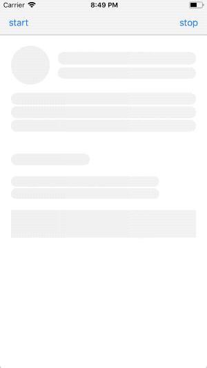

# LoadingPlaceholderView
Animated gradient placeholder with zero effort

 

# Features
- Plug and play component
- UIKit ready
- Custom component ready

# Setup
TODO
 
# Customization
You can customize the component behavior by setting the followings properties:

`fadeAnimationDuration: TimeInterval`
>The duration of the animation performed by the methods  
>`cover(_ viewToCover: UIView, animated: Bool = true)` 
>`uncover(animated: Bool = true)` 
> when animated is `true`

`gradientColor: UIColor`
>The main color of the gradient.
>Once it has been set `gradientConfiguration.backgroundColor`, `gradientConfiguration.primaryColor` and `gradientConfiguration.secondaryColor` will be calculated based on this color.

`gradientiConfiguration.width: Double`
> The width of the primary color in the gradient expressed as the percentage of the gradient size.

`gradientiConfiguration.animationDuration: TimeInterval`
>The duration of the animation of the gradient.

`gradientiConfiguration.backgroundColor: UIColor`
>The backgroundColor of the gradient.

`gradientiConfiguration.primaryColor: UIColor`
>The primaryColor of the gradient.

`gradientiConfiguration.secondaryColor: UIColor`
>The secondaryColor of the gradient.

# Usage
TODO

# Demo
In this repository you can also find a demo.

# Info
If you like this git you can follow me here or on twitter :) [@MarioIannotta](http://www.twitter.com/marioiannotta)

Cheers from Italy!
